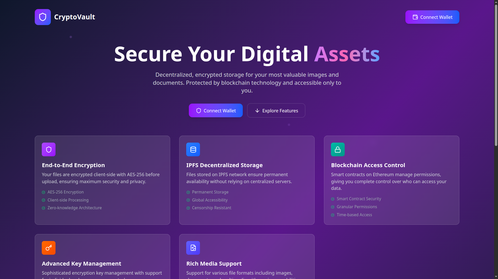

# 🔐 CryptoVault — End‑to‑End‑Encrypted Image Vaults

**CryptoVault** is a full‑stack web application that lets you create personal **vaults** and store images securely.\
Every file is encrypted in your browser with AES‑256 before it ever leaves your device, then stored on IPFS for tamper‑proof availability.

> “Your memories, your vault.”

---

## 🚀 Features

| Category        | Highlights                                                                                       |
| --------------- | ------------------------------------------------------------------------------------------------ |
|🔒**Security**   | • Client‑side AES‑256 encryption • Custom key‑management (no MetaMask required) • JWT‑secured API  |
| 🗂 **Vaults**   | • Create unlimited vaults • Search & sort by name, date, or image count                           |
| ☁️**Storage**   | • IPFS integration for decentralized hosting • Image metadata saved in MongoDB                    |
| ✨ **UX**        | • Framer Motion animations • Responsive Tailwind design |

---

## 🛠 Tech Stack

| Layer     | Technology                                                |
| --------- | --------------------------------------------------------- |
| Front‑end | **React + Vite**, TypeScript, Tailwind CSS, Framer Motion |
| Back‑end  | **Node.js**, Express, MongoDB         |
| Security  | AES‑256 encryption, JWT authentication                    |
| Storage   | IPFS (via Pinata SDK)                      |

---

## 📂 Project Structure

```text
/
├── client/ # React + Vite front‑end
│   └── src/
│       ├── components/
│       ├── hooks/
│       ├── pages/
│       └── utils/ # encryption & IPFS helpers
├── server/ # Express back‑end
│   └── src/
│       ├── controllers/
│       ├── models/ # Vault, Image, User
│       ├── routes/ # /api/vault, /api/image, /api/auth
│       └── utils/
└── README.md
```

---

## 🌍 Live Deployment

| Front‑end App                                                                                  | Back‑end API                                                                                       |
| ---------------------------------------------------------------------------------------------- | -------------------------------------------------------------------------------------------------- |
| 🔗 [**Visit CryptoVault**](https://crypto-vault-6w31.onrender.com) | 🔗 [**Start Backend**](https://cryptovault-api-service.onrender.com) |

> ⚠️ **Disclaimer:** Please start the backend by visiting the link above **before opening the frontend**.\
> The UI relies on live API endpoints for vault listings, key decryption, and uploads.

---

## 📦 API Overview (JWT‑protected)

| Method | Route                 | Purpose                                 |
| ------ | --------------------- | --------------------------------------- |
| `POST` | `/api/authentication`     | Obtain JWT after signature verification |
| `POST` | `/api/vault`   | Create a new vault                      |
| `GET`  | `/api/vault/:address` | Fetch vaults owned by a user            |
| `POST` | `/api/upload`   | Upload encrypted image metadata         |

---

---

## 🔒 Encryption Flow

```text
[Browser]
┌──────────┐  generate AES key  ┌────────────┐
│  Image   │──► Encrypt (AES) ─►│ Ciphertext │──► IPFS
└──────────┘                    └────────────┘
         │
         └─► Encrypt AES key (custom method)
                ▼
           send to backend
```

**Upload:** Client encrypts file → uploads cipher to IPFS → sends IPFS hash + encrypted key to API.\
**Download:** Client requests encrypted key → decrypts locally → downloads cipher from IPFS → decrypts image.

---

## 🧠 Resume‑Ready Highlights

- 🛡️ Built a secure full‑stack image vault platform with client‑side AES‑256 encryption and IPFS‑based decentralized storage.
- ⚙️ Designed and implemented a custom key management workflow, removing dependency on MetaMask while maintaining security.
- 🧩 Integrated a searchable vault dashboard with advanced UI components (pagination, filtering, animations) using Framer Motion and Tailwind CSS.

---


## 🖼️ Home Page Banner



---

Built with ❤️ to keep your images private and permanent.
